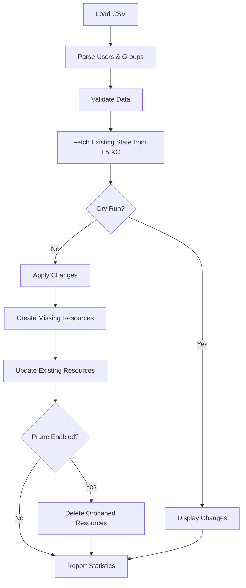

# F5 Distributed Cloud User and Group Sync

Automated synchronization tool for managing F5 Distributed Cloud (XC) users and groups from CSV user databases.

[](https://www.python.org/downloads/)
[](LICENSE)
[](https://github.com/psf/black)

## Overview

**f5-xc-user-group-sync** is a Python command-line tool that reconciles F5 Distributed Cloud users and groups with your authoritative user database (exported as CSV). This enables automated user lifecycle management and group membership synchronization from existing identity sources like Active Directory or LDAP.

### Key Features

- **🔄 Automated Reconciliation**: Synchronizes users and groups between CSV and F5 XC
- **✅ Data Validation**: Pre-validates CSV data and user existence before making changes
- **🔒 Safe Operations**: Dry-run mode to preview changes before applying
- **🚀 CI/CD Ready**: Sample workflows for GitHub Actions and Jenkins
- **📊 Detailed Reporting**: Comprehensive statistics and error tracking
- **🔁 Retry Logic**: Automatic retry with exponential backoff for API failures
- **🎯 Flexible Control**: Independent user/group synchronization with optional pruning

### What Does It Do?

This tool performs bidirectional reconciliation between your CSV user database and F5 XC:

**Synchronization Operations:**

- ✅ **Creates** users and groups that exist in CSV but not in F5 XC
- ✅ **Updates** user attributes (name, active status) and group memberships to match CSV
- ✅ **Prunes** users and groups not in CSV (optional, with `--prune` flag)

**Safety Features:**

- ✅ **Validates** all data before making changes
- ✅ **Dry-run mode** to preview changes safely
- ✅ **Error handling** with detailed reporting
- ✅ **Transaction safety** with rollback capabilities

## Table of Contents

- [Prerequisites](#prerequisites)
- [Installation](#installation)
- [Quick Start](#quick-start)
- [Configuration](#configuration)
- [CSV Format](#csv-format)
- [Usage](#usage)
- [CI/CD Integration](#cicd-integration)
- [Architecture](#architecture)
- [Development](#development)
- [Troubleshooting](#troubleshooting)
- [Security](#security)
- [Support](#support)

## Prerequisites

Before you begin, ensure you have:

1. **Python 3.9 or higher** installed

   ```bash
   python3 --version  # Should show 3.9 or higher
   ```

2. **F5 XC API credentials** (P12 certificate with password)
   - Download from: F5 XC Console → Administration → Credentials → API Credentials
   - Save the `.p12` file securely (e.g., `~/Downloads/your-tenant.p12`)

3. **CSV export** from your user database
   - Must include user emails and group memberships in LDAP DN format
   - See [CSV Format](#csv-format) section for details

4. **GitHub CLI** (optional, for automated secret management)

   ```bash
   # macOS
   brew install gh

   # Linux
   curl -fsSL https://cli.github.com/packages/githubcli-archive-keyring.gpg | sudo dd of=/usr/share/keyrings/githubcli-archive-keyring.gpg
   echo "deb [arch=$(dpkg --print-architecture) signed-by=/usr/share/keyrings/githubcli-archive-keyring.gpg] https://cli.github.com/packages stable main" | sudo tee /etc/apt/sources.list.d/github-cli.list > /dev/null
   sudo apt update && sudo apt install gh
   ```

## Installation

### Option 1: Local Development Installation

```bash
# Clone the repository
git clone https://github.com/robinmordasiewicz/f5-xc-user-group-sync.git
cd f5-xc-user-group-sync

# Create and activate virtual environment
python3 -m venv .venv
source .venv/bin/activate  # On Windows: .venv\Scripts\activate

# Install in development mode
pip install -e .

# Verify installation
xc-group-sync --help
```

### Option 2: Direct Installation from Git

```bash
# Install directly from GitHub
pip install git+https://github.com/robinmordasiewicz/f5-xc-user-group-sync.git

# Verify installation
xc-group-sync --help
```

## Quick Start

### 1. Setup Credentials

#### Automated Setup (Recommended)

The easiest way to configure your credentials:

```bash
# Basic setup - auto-detects single .p12 file in ~/Downloads
./scripts/setup_xc_credentials.sh

# Explicit P12 file path
./scripts/setup_xc_credentials.sh --p12 ~/Downloads/your-tenant.p12

# Skip GitHub secrets (local use only)
./scripts/setup_xc_credentials.sh --p12 ~/Downloads/your-tenant.p12 --no-secrets
```

**The script will:**

- Extract tenant ID from the P12 filename
- Auto-detect environment (production: `.console.ves.volterra.io` or staging: `.staging.volterra.us`)
- Convert P12 to PEM certificate and key files
- Create `secrets/.env` with all required variables
- Set GitHub repository secrets (if using CI/CD and `--no-secrets` not specified)

**You will be prompted for:**

- P12 passphrase (if `VES_P12_PASSWORD` environment variable is not already set)

#### Manual Setup

If you prefer manual configuration:

1. **Create secrets directory:**

   ```bash
   mkdir -p secrets
   chmod 700 secrets
   ```

2. **Extract certificate and key from P12:**

   ```bash
   # Extract certificate
   openssl pkcs12 -in your-tenant.p12 -clcerts -nokeys -out secrets/cert.pem

   # Extract private key (no password)
   openssl pkcs12 -in your-tenant.p12 -nocerts -nodes -out secrets/key.pem

   # Secure the files
   chmod 600 secrets/*.pem
   ```

3. **Create `secrets/.env` file:**

   ```bash
   cat > secrets/.env << 'EOF'
   TENANT_ID=your-tenant-id
   XC_API_URL=https://your-tenant-id.console.ves.volterra.io
   VOLT_API_CERT_FILE=/absolute/path/to/f5-xc-user-group-sync/secrets/cert.pem
   VOLT_API_CERT_KEY_FILE=/absolute/path/to/f5-xc-user-group-sync/secrets/key.pem
   EOF

   chmod 600 secrets/.env
   ```

   > **Note**: `XC_API_URL` is optional. If not specified, it defaults to:
   >
   > - Production: `https://{TENANT_ID}.console.ves.volterra.io`
   > - Staging: `https://{TENANT_ID}.staging.volterra.us`

### 2. Prepare Your CSV File

Your CSV must contain these columns:

| Column | Description | Example |
|--------|-------------|---------|
| `Login ID` | User's LDAP DN | `CN=USER001,OU=Users,DC=example,DC=com` |
| `Email` | User's email (must match F5 XC profile) | `alice@example.com` |
| `Entitlement Attribute` | Must be `memberOf` | `memberOf` |
| `Entitlement Display Name` | Group LDAP DN | `CN=EADMIN_STD,OU=Groups,DC=example,DC=com` |

**Example CSV:**

```csv
"User Name","Login ID","Email","Entitlement Attribute","Entitlement Display Name"
"Alice Anderson","CN=USER001,OU=Users,DC=example,DC=com","alice@example.com","memberOf","CN=EADMIN_STD,OU=Groups,DC=example,DC=com"
"Bob Brown","CN=USER002,OU=Users,DC=example,DC=com","bob@example.com","memberOf","CN=EADMIN_STD,OU=Groups,DC=example,DC=com"
"Carol Chen","CN=USER003,OU=Users,DC=example,DC=com","carol@example.com","memberOf","CN=DEVELOPER,OU=Groups,DC=example,DC=com"
```

See the [CSV Format](#csv-format) section for complete specifications.

### 3. Test with Dry-Run

**Always test first** to preview changes:

```bash
# Load credentials
source secrets/.env

# Preview reconciliation (no actual changes)
xc-group-sync --csv ./User-Database.csv --dry-run

# Preview with pruning enabled
xc-group-sync --csv ./User-Database.csv --prune --dry-run
```

The dry-run output shows:

- ✅ Users and groups to be created
- ✅ Users and groups to be updated (with changes highlighted)
- ✅ Users and groups to be deleted (with `--prune`)
- ✅ Validation errors and warnings
- ✅ **No actual changes are made**

### 4. Apply Changes

Once satisfied with dry-run results:

```bash
# Reconcile users and groups (create/update only)
xc-group-sync --csv ./User-Database.csv

# Full reconciliation including pruning
xc-group-sync --csv ./User-Database.csv --prune
```

> **⚠️ Important**: The `--prune` flag will **permanently delete** F5 XC users and groups that don't exist in your CSV. Always test with `--dry-run` first.

## Configuration

### Environment Variables

The tool uses these environment variables for authentication and configuration:

| Variable | Required | Description | Default |
|----------|----------|-------------|---------|
| `TENANT_ID` | Yes | Your F5 XC tenant ID | N/A |
| `VOLT_API_CERT_FILE` | Yes* | Path to PEM certificate file | N/A |
| `VOLT_API_CERT_KEY_FILE` | Yes* | Path to PEM private key file | N/A |
| `XC_API_TOKEN` | Yes** | API token (alternative to cert auth) | N/A |
| `XC_API_URL` | No | F5 XC API endpoint URL | `https://{TENANT_ID}.console.ves.volterra.io` |

\* Required for certificate-based authentication (recommended)
\*\* Required if not using certificate authentication

### Configuration File

You can store environment variables in `secrets/.env`:

```bash
# Required
TENANT_ID=your-tenant-id

# Certificate-based authentication (recommended)
VOLT_API_CERT_FILE=/absolute/path/to/secrets/cert.pem
VOLT_API_CERT_KEY_FILE=/absolute/path/to/secrets/key.pem

# Optional: Override API URL
XC_API_URL=https://your-tenant-id.console.ves.volterra.io
```

Load the configuration:

```bash
source secrets/.env
xc-group-sync --csv ./User-Database.csv --dry-run
```

### API URL Auto-Detection

The tool automatically derives the API URL based on your tenant ID:

- **Production**: `https://{TENANT_ID}.console.ves.volterra.io`
- **Staging**: `https://{TENANT_ID}.staging.volterra.us` (if tenant contains "staging")

Override with `XC_API_URL` environment variable if needed.

## CSV Format

### Required Columns

Your CSV must include these exact column headers:

- **User Name** (optional): Display name for the user
- **Login ID** (required): LDAP Distinguished Name in DN format
- **Email** (required): User's email address matching their F5 XC profile
- **Entitlement Attribute** (required): Must contain `memberOf`
- **Entitlement Display Name** (required): Group LDAP DN

### LDAP DN Format

Both user and group identifiers must be in LDAP Distinguished Name format:

**User DN Example:**

```text
CN=USER001,OU=Users,DC=example,DC=com
```

**Group DN Example:**

```text
CN=EADMIN_STD,OU=Groups,DC=example,DC=com
```

### Group Name Conversion

F5 XC group names are automatically sanitized:

- **Original**: `CN=EADMIN STD,OU=Groups,DC=example,DC=com`
- **Converted**: `EADMIN_STD` (spaces → underscores, only alphanumeric + `_` + `-`)

### Sample CSV

```csv
"User Name","Login ID","Email","Entitlement Attribute","Entitlement Display Name"
"Alice Anderson","CN=USER001,OU=Users,DC=example,DC=com","alice@example.com","memberOf","CN=EADMIN_STD,OU=Groups,DC=example,DC=com"
"Alice Anderson","CN=USER001,OU=Users,DC=example,DC=com","alice@example.com","memberOf","CN=DEVELOPER,OU=Groups,DC=example,DC=com"
"Bob Brown","CN=USER002,OU=Users,DC=example,DC=com","bob@example.com","memberOf","CN=EADMIN_STD,OU=Groups,DC=example,DC=com"
```

> **Note**: Users can have multiple rows for multiple group memberships.

## Usage

### Command-Line Interface

```bash
xc-group-sync [OPTIONS]
```

### Options

| Option | Type | Default | Description |
|--------|------|---------|-------------|
| `--csv <path>` | Required | N/A | Path to CSV file with user/group data |
| `--dry-run` | Flag | `false` | Preview changes without applying |
| `--prune` | Flag | `false` | Delete users/groups in F5 XC not in CSV |
| `--log-level <level>` | Choice | `info` | Logging verbosity: `debug`, `info`, `warn`, `error` |
| `--timeout <seconds>` | Integer | `30` | HTTP request timeout |
| `--max-retries <n>` | Integer | `3` | Maximum retries for API errors |

### Usage Examples

#### Basic Operations

```bash
# Preview reconciliation (recommended first step)
xc-group-sync --csv users.csv --dry-run

# Apply reconciliation (create/update only)
xc-group-sync --csv users.csv

# Full reconciliation including pruning
xc-group-sync --csv users.csv --prune

# Dry-run with pruning preview
xc-group-sync --csv users.csv --prune --dry-run
```

#### Advanced Configuration

```bash
# Debug logging for troubleshooting
xc-group-sync --csv users.csv --dry-run --log-level debug

# Increased timeout for large datasets
xc-group-sync --csv users.csv --timeout 60

# More retries for unstable networks
xc-group-sync --csv users.csv --max-retries 5

# Combined: debug with increased retry
xc-group-sync --csv users.csv --log-level debug --max-retries 5 --timeout 60
```

### Output Example

```text
============================================================
📦 GROUP SYNCHRONIZATION
============================================================
Groups planned from CSV: 3
    - EADMIN_STD: 5 users
    - DEVELOPER: 3 users
    - SECURITY_TEAM: 2 users

Existing groups in F5 XC: 2

✅ Creating group: SECURITY_TEAM
✅ Updating group: EADMIN_STD (membership changed)
➡️  No changes needed: DEVELOPER

============================================================
👤 USER SYNCHRONIZATION
============================================================
CSV Validation Results:
    ✅ Valid users: 8
    ⚠️  Warnings: 1
        - alice@example.com: Multiple group memberships (2 groups)

Existing users in F5 XC: 7

✅ Creating user: charlie@example.com
✅ Updating user: alice@example.com (groups changed)
➡️  No changes for 6 users

============================================================
✅ SYNCHRONIZATION COMPLETE
============================================================
Execution time: 3.45 seconds
Groups: 1 created, 1 updated
Users: 1 created, 1 updated
```

## CI/CD Integration

This repository provides **sample CI/CD configurations** for automated synchronization workflows.

### Getting Started

**📁 Sample Location**: `samples/ci-cd/`

**Available Platforms:**

- **GitHub Actions** (`github-actions/`)
    - `xc-user-group-sync.yml.sample` - Main sync workflow
    - `pre-commit.yml.sample` - Code quality checks

- **Jenkins** (`jenkins/`)
    - `Jenkinsfile.declarative.sample` - Declarative Pipeline
    - `Jenkinsfile.scripted.sample` - Scripted Pipeline

### GitHub Actions Setup

1. **Copy the sample workflow:**

   ```bash
   cp samples/ci-cd/github-actions/xc-user-group-sync.yml.sample \
      .github/workflows/xc-user-group-sync.yml
   ```

2. **Configure repository secrets:**
   - Go to: **Settings → Secrets and variables → Actions**
   - Add secrets:

     ```text
     TENANT_ID          # Your F5 XC tenant ID
     XC_CERT            # PEM certificate (raw text)
     XC_CERT_KEY        # PEM private key (raw text)
     ```

3. **Review and customize the workflow**, then commit to enable

### Jenkins Setup

1. **Copy the sample Jenkinsfile:**

   ```bash
   cp samples/ci-cd/jenkins/Jenkinsfile.declarative.sample Jenkinsfile
   ```

2. **Configure Jenkins credentials:**
   - Create credentials with IDs:
       - `TENANT_ID` (Secret text)
       - `XC_CERT` (Secret text - PEM certificate)
       - `XC_CERT_KEY` (Secret text - PEM private key)

3. **Create a Pipeline job** pointing to your repository

### Complete CI/CD Documentation

For detailed setup instructions, authentication options, customization examples, and troubleshooting:

**📖 See**: [`samples/ci-cd/README.md`](samples/ci-cd/README.md)

Topics covered:

- PEM vs P12 authentication
- Scheduling automated runs
- Notification integration (Slack, email)
- Approval gates for production
- Security best practices
- Troubleshooting common issues

## Architecture

### Project Structure

```text
f5-xc-user-group-sync/
├── src/xc_user_group_sync/       # Main package
│   ├── cli.py                     # Command-line interface
│   ├── client.py                  # F5 XC API client
│   ├── sync_service.py            # Group synchronization logic
│   ├── user_sync_service.py       # User synchronization logic
│   ├── models.py                  # Data models (User, Group, Config)
│   ├── protocols.py               # Repository interfaces
│   ├── ldap_utils.py              # LDAP DN parsing utilities
│   └── user_utils.py              # User attribute parsing
├── tests/                         # Test suite
│   ├── unit/                      # Unit tests
│   ├── integration/               # Integration tests
│   └── test_*.py                  # Component tests
├── scripts/                       # Utility scripts
│   └── setup_xc_credentials.sh    # Credential setup automation
├── samples/                       # Reference implementations
│   └── ci-cd/                     # CI/CD sample configurations
│       ├── github-actions/        # GitHub Actions workflows
│       └── jenkins/               # Jenkins Pipelines
├── secrets/                       # Credentials (gitignored)
│   ├── .env                       # Environment variables
│   ├── cert.pem                   # API certificate
│   └── key.pem                    # API private key
├── pyproject.toml                 # Project metadata and dependencies
├── CLAUDE.md                      # Development guidelines
└── README.md                      # This file
```

### Component Overview

**Core Components:**

1. **CLI (`cli.py`)**: Command-line interface with argument parsing and workflow orchestration
2. **XCClient (`client.py`)**: F5 XC API client with authentication, retry logic, and error handling
3. **GroupSyncService (`sync_service.py`)**: Group reconciliation logic
4. **UserSyncService (`user_sync_service.py`)**: User reconciliation logic
5. **Data Models (`models.py`)**: Pydantic models for type safety and validation

**Utilities:**

- **LDAP Utilities (`ldap_utils.py`)**: Parse LDAP Distinguished Names
- **User Utilities (`user_utils.py`)**: Extract user attributes from display names
- **Protocols (`protocols.py`)**: Repository interfaces for dependency injection

### Synchronization Flow



### Error Handling

The tool implements comprehensive error handling:

- **API Errors**: Automatic retry with exponential backoff (configurable via `--max-retries`)
- **Validation Errors**: Pre-validation before API calls to catch issues early
- **Partial Failures**: Continue processing remaining items, track errors for final report
- **Transaction Safety**: No partial group updates; operations are atomic

### Testing

**Test Coverage**: 199 tests across unit and integration suites

**Test Categories** (via pytest markers):

- `unit` - Fast unit tests with mocking
- `integration` - Real component interaction tests
- `cli` - Command-line interface tests
- `api` - API client functionality tests
- `service` - Business logic tests
- `edge_case` - Edge cases and error handling
- `security` - Security-related functionality

**Run Tests:**

```bash
# All tests
pytest tests/

# Specific category
pytest -m unit
pytest -m integration

# With coverage report
pytest --cov=xc_user_group_sync --cov-report=html
```

## Development

### Development Setup

```bash
# Clone and setup
git clone https://github.com/robinmordasiewicz/f5-xc-user-group-sync.git
cd f5-xc-user-group-sync

# Create virtual environment
python3 -m venv .venv
source .venv/bin/activate

# Install with development dependencies
pip install -e ".[dev]"

# Install pre-commit hooks
pre-commit install
```

### Development Commands

```bash
# Run tests
pytest tests/ -v

# Run tests with coverage
pytest --cov=xc_user_group_sync --cov-report=html --cov-report=term

# Code formatting
black src/ tests/

# Linting
ruff check src/ tests/

# Type checking
mypy src/

# All quality checks (what pre-commit runs)
pre-commit run --all-files
```

### Code Quality Standards

This project enforces:

- **Black** - Code formatting (line length: 88)
- **Ruff** - Fast Python linter (PEP 8, import sorting)
- **MyPy** - Static type checking
- **pytest** - Testing framework (minimum 80% coverage)
- **pre-commit** - Git hooks for automated checks

### Contributing Guidelines

1. **Create feature branch** from `main`
2. **Write tests** for new functionality (maintain 80%+ coverage)
3. **Follow code style** (enforced by pre-commit hooks)
4. **Update documentation** for user-facing changes
5. **Run all checks** before committing:

   ```bash
   pytest tests/ --cov=xc_user_group_sync
   black src/ tests/
   ruff check src/ tests/
   mypy src/
   ```

6. **Submit pull request** with clear description

See [`CLAUDE.md`](CLAUDE.md) for detailed development guidelines.

## Troubleshooting

### Common Issues

#### "TENANT_ID environment variable not set"

**Cause**: Environment variables not loaded

**Solution:**

```bash
# Verify secrets/.env exists
cat secrets/.env

# Load environment
source secrets/.env

# Or re-run setup
./scripts/setup_xc_credentials.sh --p12 your-file.p12
```

#### "User email@example.com not found in XC"

**Cause**: User doesn't exist in F5 XC or email mismatch

**Solution:**

```bash
# Enable debug logging to see all XC emails
xc-group-sync --csv file.csv --log-level debug --dry-run

# Verify email matches exactly (case-sensitive)
# User must exist in F5 XC before group assignment
```

#### "Invalid group name: GROUP NAME"

**Cause**: F5 XC requires alphanumeric characters, hyphens, underscores only

**Solution**: The tool automatically converts invalid characters (spaces → underscores). Check logs for converted name.

**Example:**

- Original: `CN=EADMIN STD,OU=Groups,DC=example,DC=com`
- Converted: `EADMIN_STD`

#### "API rate limit (429) exceeded"

**Cause**: Too many API requests in short time

**Solution**:

```bash
# Tool auto-retries with backoff. If persists, increase retries:
xc-group-sync --csv file.csv --max-retries 5 --timeout 60
```

#### Certificate/Authentication Errors

**Solution:**

```bash
# Verify certificate validity
openssl x509 -in secrets/cert.pem -noout -text

# Verify private key validity
openssl rsa -in secrets/key.pem -check

# Check permissions (should be 600)
ls -la secrets/

# Re-extract if corrupted
./scripts/setup_xc_credentials.sh --p12 your-file.p12
```

#### SSL Certificate Verification Issues (Staging)

**Problem**: Python fails with SSL verification errors on staging environments

**Why**: Staging environments use self-signed CAs not in Python's trust store

**Solutions:**

**Option 1 (Testing Only)** - Disable SSL verification:

```bash
# ⚠️ DANGER: Only for non-production testing
export REQUESTS_CA_BUNDLE=""
xc-group-sync --csv file.csv
```

**Option 2 (Recommended)** - Add staging CA to Python trust store:

```bash
# Export staging CA
openssl s_client -showcerts -connect tenant.staging.ves.volterra.io:443 </dev/null 2>/dev/null | \
  openssl x509 -outform PEM > staging-ca.pem

# Find certifi location
python3 -c "import certifi; print(certifi.where())"

# Append to certifi bundle
cat staging-ca.pem >> $(python3 -c "import certifi; print(certifi.where())")
```

**Option 3 (Best)** - Use production credentials:

```bash
# Production environments use standard certificates
TENANT_ID=your-prod-tenant xc-group-sync --csv file.csv
```

### Debug Mode

For maximum visibility:

```bash
xc-group-sync --csv file.csv --dry-run --log-level debug
```

Debug mode shows:

- All API requests and responses
- CSV parsing details
- Validation logic decisions
- Group membership calculations
- LDAP DN parsing steps
- User attribute processing
- Retry attempts and backoff timing

## Security

### Credential Management Best Practices

**✅ DO:**

- Store credentials in `secrets/` directory (gitignored)
- Use repository secrets for CI/CD (GitHub, Jenkins)
- Set restrictive permissions: `chmod 600` on PEM files, `chmod 700` on `secrets/` directory
- Rotate API credentials regularly (quarterly recommended)
- Use separate credentials for dev/staging/production
- Clean up credential files after pipeline execution

**❌ DON'T:**

- Commit `.p12`, `.pem`, or `.env` files to git
- Share credentials in logs, screenshots, or documentation
- Use production credentials in development/testing
- Store credentials in plain text outside `secrets/`
- Print credential values in logs or console output

### Safe Synchronization Practices

1. **Always dry-run first**: Test with `--dry-run` before applying changes
2. **Review changes carefully**: Check dry-run output for unexpected modifications
3. **Start without prune**: Omit `--prune` until confident in CSV data accuracy
4. **Monitor logs**: Use `--log-level debug` for troubleshooting
5. **Backup first**: Document current F5 XC state before bulk changes
6. **Test on staging**: Validate on non-production environment first
7. **Gradual rollout**: Start with small user groups, expand incrementally

### Authentication Security

The tool supports two authentication methods:

**Certificate-based (Recommended):**

- More secure than token-based
- Short-lived credentials
- Automatic expiration
- No credential rotation needed

**Token-based:**

- Simpler setup
- Requires manual rotation
- Higher security risk if leaked

### Secrets in CI/CD

**GitHub Actions:**

- Use repository/environment secrets
- Never use secrets in fork pull requests
- Enable secret scanning

**Jenkins:**

- Use credential binding
- Restrict access to credential stores
- Audit credential usage

## Support

### Documentation Resources

- **GitHub Repository**: https://github.com/robinmordasiewicz/f5-xc-user-group-sync
- **GitHub Issues**: https://github.com/robinmordasiewicz/f5-xc-user-group-sync/issues
- **F5 XC Documentation**: https://docs.cloud.f5.com/docs/api
- **F5 XC API Reference**: https://docs.cloud.f5.com/docs/api/views-iam

### Getting Help

**For issues with:**

- **This tool**: Open an issue on GitHub with debug logs and CSV format (redact sensitive data)
- **F5 XC Platform**: Contact F5 support or consult F5 XC documentation
- **CI/CD Integration**: See [`samples/ci-cd/README.md`](samples/ci-cd/README.md)

**When reporting issues, include:**

- Tool version: `pip show f5-xc-user-group-sync`
- Python version: `python3 --version`
- Command executed (redact sensitive data)
- Full error output with `--log-level debug`
- CSV structure (sample rows, no real data)

## License

This project is licensed under the MIT License - see the [LICENSE](LICENSE) file for details.

## Acknowledgments

- F5 Distributed Cloud team for API documentation and support
- Python community for excellent libraries (click, pydantic, tenacity)
- Contributors and users providing feedback and improvements

---

**Project Status**: Active Development
**Maintainer**: Robin Mordasiewicz
**Python Version**: 3.9+ (tested on 3.12)
**Latest Release**: 0.1.0
